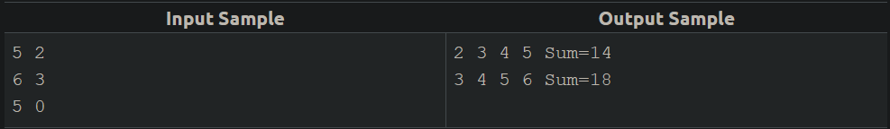

Read an undetermined number of pairs values M and N (stop when any of these values is less or equal to zero). For each pair, print the sequence from the smallest to the biggest (including both) and the sum of consecutive integers between them (including both).

Input
The input file contains pairs of integer values M and N. The last line of the file contains a number zero or negative, or both.

Output
For each pair of numbers, print the sequence from the smallest to the biggest and the sum of these values, as shown below.

